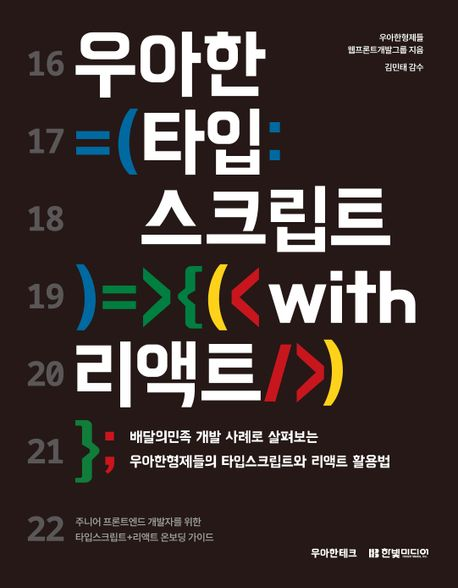

# 📚우아한 타입 스크립트 with 리액트 스터디 / 우아한형제들

 

### 📍기간

2024.5월 30일 ~ 7월 11일 (총 7주 소요)

 

### 📍내용

- 프론트앤드 개발의 타입스크립트 지식 함양을 위한 스터디

 

### 📍목표

- 타입스크립트를 더 이해하기

 

### 📍방법

일주일에 각자 맡은 챕터 읽고 세미나 발표하기

 

### 📍스케쥴

매주 목요일 4시 30분 ~ 5시 30분

 

### 📍진행 내역 & 목차

* 1장~5장 까지는 기초적인 주제로 패스

- ✅ [6장 타입스크립트 컴파일](./2주차/6장.md)
- ✅ [7장 비동기 호출](./2주차/7장.md)
- ✅ [8장 JSX에서 TSX로](./3주차/8장.md)
- ✅ [9장 훅 Hook](./3주차/9장.md)
- ✅ [10장 상태관리](./3주차/10장.md)
- ✅ [11장 CSS in JS](./3주차/11장.md)
- ✅ [12장 타입 스크립트 프로젝트 관리](./3주차/12장.md)
- ✅ [13장 타입스크립트와 객체 지향](./3주차/13장.md)

