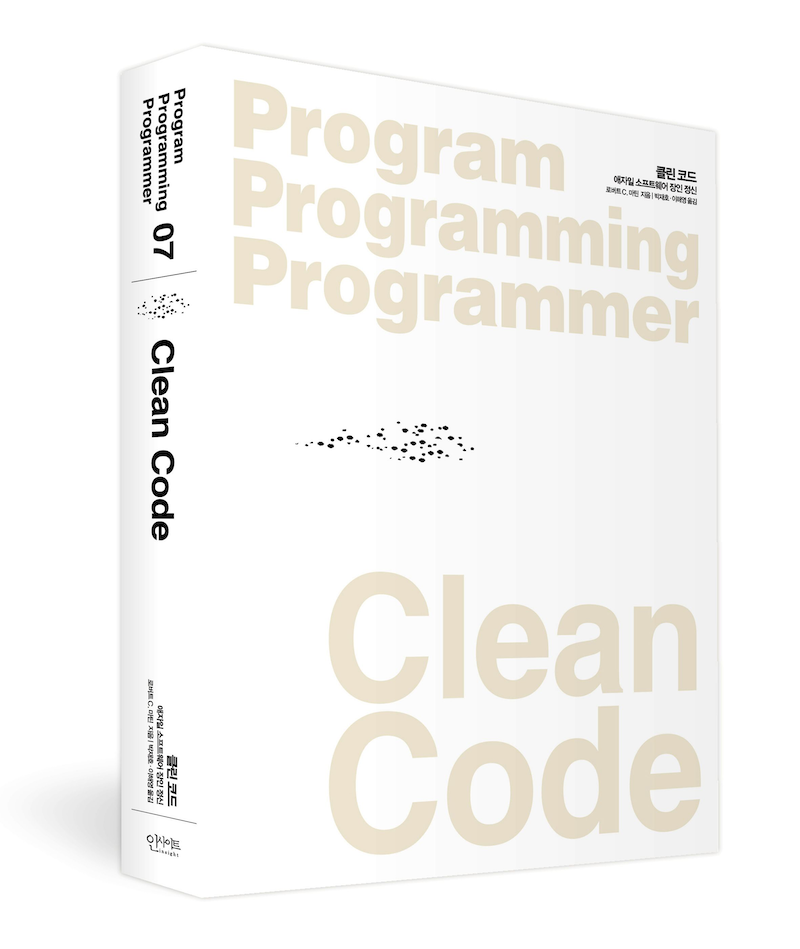

# 1️⃣ 클린코드 (Clean Code) / 로버트C.마틴

 

### 📍기간

2023.09.11일 ~ 10.09일 (총 5주 소요)

 

### 📍내용

- 프론트엔드 지식 함양을 위한 스터디

  - CleanCode를 읽고 발표 & 질의응답 시간 갖고 토론하기

 

### 📍목표

이 책은 주니어 개발자들에게 많이 추천되는 코딩 교과서라고 볼 수있다.
이번 스터디를 통해 코드의 퀄리티를 높이자
서로 코드 리뷰시 크로스 체킹 하면서 서로에게 도움되기

 

### 📍방법

일주일에 3챕터 씩 읽고 각자 한 챕터씩 발표 범위를 선택

모든 사람의 발표 범위를 예습 해와야 함

각자의 범위는 발표하고 질의 응답 진행

 

### 📍스케쥴

매주 월요일 PM 6시 ~ 미정

 

### 📍진행 내역 & 목차

- ✅ [1장 깨끗한 코드](./1주차/1장_깨끗한코드.md)

- ✅ [2장 의미 있는 이름](./1주차/2장_의미있는이름.md)

- ✅ [3장 함수](./1주차/3장_함수.md)

- ✅ [4장 주석](./2주차/4장_주석.md)

- ✅ [5장 형식 맞추기](./2주차/5장_형식맞추기.md)

- ✅ [6장 객체와 자료 구조](./2주차/6장_객체와자료구조.md)

- 7장 오류 처리

- ✅ [8장 경계](./3주차/08장_경계.md)

- ✅ [9장 단위 테스트](./3주차/09장_단위테스트.md)

- ✅ [10장 클래스](./3주차/10장_클래스.md)

- 11장 시스템

- ✅ [12장 창발성](./3주차/12장_창발성.md)

* 13장~17장 까지는 **JAVA** 얘기들이 많은 이유로 패스
